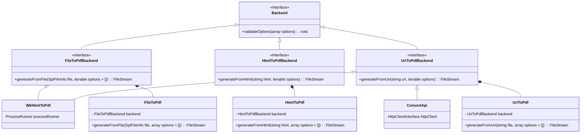

# Snappy


[](https://ci.appveyor.com/project/NiR-/snappy)
[](https://scrutinizer-ci.com/g/KnpLabs/snappy/?branch=master)

Snappy is a PHP library allowing thumbnail, snapshot or PDF generation from a url or a html page.
It uses the excellent webkit-based [wkhtmltopdf and wkhtmltoimage](http://wkhtmltopdf.org/)
available on OSX, linux, windows.

You will have to download wkhtmltopdf `0.12.x` in order to use Snappy.

Please, check [FAQ](doc/faq.md) before opening a new issue. Snappy is a tiny wrapper around wkhtmltox, so lots of issues are already answered, resolved or wkhtmltox ones.

Following integrations are available:

* [`knplabs/knp-snappy-bundle`](https://github.com/KnpLabs/KnpSnappyBundle), for Symfony
* [`barryvdh/laravel-snappy`](https://github.com/barryvdh/laravel-snappy), for Laravel
* [`mvlabs/mvlabs-snappy`](https://github.com/mvlabs/MvlabsSnappy), for Zend Framework

## Installation using [Composer](http://getcomposer.org/)

```bash
composer require knplabs/knp-snappy
```

## Usage

### Initialization

```php
<?php

require __DIR__ . '/vendor/autoload.php';

use KnpLabs\Snappy\Backend\WkHtmlToPdf;
use KnpLabs\Snappy\Frontend\UriToPdf;
use KnpLabs\Snappy\Process\ProcessRunner;

$processRunner = new ProcessRunner();
$backend = new WkHtmlToPdf('/usr/bin/wkhtmltopdf', $processRunner);
$frontend = new UriToPdf($backend);

$stream = $frontend->generateFromUri('https://github.com/KnpLabs/snappy');

$stream->copyTo('var/snappy-readme.pdf');
```

## Design



## Bugs & Support

If you found a bug please fill a detailed issue with all the following points.
If you need some help, please at least provide a complete reproducer so we could help you based on facts rather than assumptions.

* OS and its version
* Wkhtmltopdf, its version and how you installed it
* A complete reproducer with relevant php and html/css/js code

If your reproducer is big, please try to shrink it. It will help everyone to narrow the bug.****

## Credits

Snappy has been originally developed by the [KnpLabs](http://knplabs.com) team.
